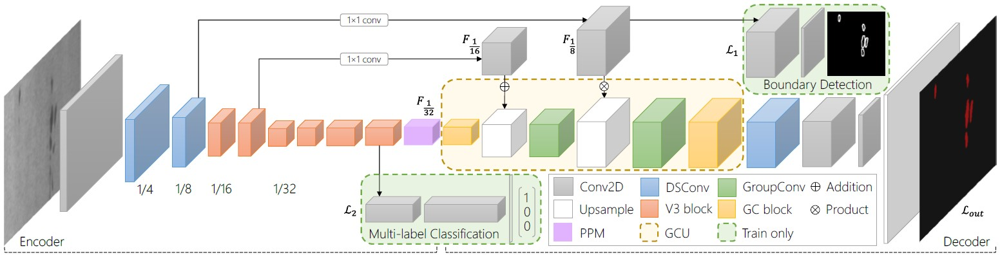

# FDSNet
FDSNet: An Accurate Real-Time Surface Defect Segmentation Network

paper [[pdf](https://ieeexplore.ieee.org/abstract/document/9747311)]

## Dataset
### ⭐️ [MSD](https://github.com/jianzhang96/MSD) dataset ⭐️
The generated auxiliary ground-truth [AuxiliaryGT](https://1drv.ms/u/s!AhqlXalcO8TlgQNVPQYyJPoBQG1k?e=gqXnRr) for MSD dataset.
The images of MSD dataset are downsampled to 1440×810 during training and test. <br>
We convert [SD-saliency-900](https://github.com/SongGuorong/MCITF/tree/master/SD-saliency-900) and [Magnetic-tile-defect-datasets](https://github.com/abin24/Magnetic-tile-defect-datasets.) (denoted as MT-Defect) dataset to PASCAL VOC format and divide the datasets
into train: val: test = 6: 2: 2 randomly. We use trainval-test for NEU-Seg and MT-Defect and train-test for MSD dataset. The converted datasets can be downloaded here: [MT-Defect](https://1drv.ms/u/s!AhqlXalcO8TlgQLtuDrRig6JfIju?e=wE8sjx) and [NEU-Seg](https://1drv.ms/u/s!AhqlXalcO8TlgQGHVQR0soRxX76b?e=Nx0FpY).

## Environment
Python 3.8.5 PyTorch 1.9.0 CUDA 11.1 <br/>
one NVIDIA GTX 1080Ti GPU
```
conda env create -f requirements.yml
```

## Usage
First download the dataset and the auxiliary ground-truth. Put the auxiliary GT to the data folder and modify the path in the /core/data/dataloader.<br/>
when train model on NEU-Seg, set scale-ratio=None. when train model on MT-Defect, set crop size=450 and base_size not None. <br/>
Train model
```
CUDA_VISIBLE_DEVICES=0 python train.py --model fdsnet --use-ohem True --aux True --dataset phone_voc --scale-ratio 0.75 --lr 0.0001 --epochs 150 --batch-size 8
```
Eval model. We eval the image one by one.
```
python eval.py
```
## Pretrained Model
| Dataset | Pth | mIoU | FPS |
| :------| :------ | :------ |  :------ |
| MSD | [fastscnn__phone_voc_best_model.pth](https://1drv.ms/u/s!AhqlXalcO8TlgQQs7ceX4GQTmFsX?e=dJUuFg) | 89.1 | 115.0 |
| MSD | [fdsnet__phone_voc_best_model.pth](https://1drv.ms/u/s!AhqlXalcO8TlfvMadgOHhCtN7Po?e=yhg6aD) | 90.2 | 135.0 |
| MT-Defect | [fdsnet__mt_voc_best_model.pth](https://1drv.ms/u/s!AhqlXalcO8TlgQDawGlGxSULqrBQ?e=bXq6TS) | 63.9 | 181.5 |
| NEU-Seg | [fdsnet__sd_voc_best_model.pth](https://1drv.ms/u/s!AhqlXalcO8Tlf7DoUKO59J82GAM?e=GLIt9X) | 78.8 | 186.1 |

## Results


## Code Borrow
[Semantic Segmentation on PyTorch](https://github.com/Tramac/awesome-semantic-segmentation-pytorch) <br>
[Fast-SCNN](https://github.com/Tramac/Fast-SCNN-pytorch)
