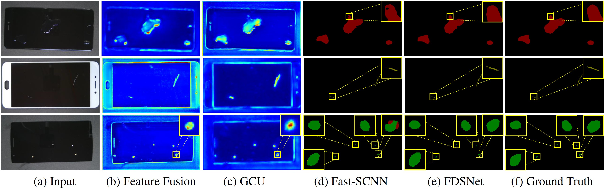

# FDSNet
FDSNet: An Accurate Real-Time Surface Defect Segmentation Network

### Dataset
[MSD](https://github.com/jianzhang96/MSD) dataset.<br/>
The images of MSD dataset are downsampled to 1440×810 during training and test. <br>
We convert [SD-saliency-900](https://github.com/SongGuorong/MCITF/tree/master/SD-saliency-900) and [Magnetic-tile-defect-datasets](https://github.com/abin24/Magnetic-tile-defect-datasets) (denoted as MT-Defect) dataset to PASCAL VOC format and divide the datasets
into train: val: test = 6: 2: 2 randomly. We use trainval-test for NEU-Seg and MT-Defect and train-test for MSD dataset. The converted datasets can be downloaded here: [MT-Defect](https://1drv.ms/u/s!AhqlXalcO8TlgQLtuDrRig6JfIju?e=wE8sjx) and [NEU-Seg](https://1drv.ms/u/s!AhqlXalcO8TlgQGHVQR0soRxX76b?e=Nx0FpY).

### Environment
Python 3.8.5 PyTorch 1.9.0 CUDA 11.1
```
conda env create -f requirements.yml
```
### Pretrained Model
| Dataset | Pth | mIoU |
| :------| :------ | :------ |
| MSD | [fdsnet__phone_voc_best_model.pth](https://1drv.ms/u/s!AhqlXalcO8TlfvMadgOHhCtN7Po?e=yhg6aD) | 90.2 |
| MT-Defect | [fdsnet__mt_voc_best_model.pth](https://1drv.ms/u/s!AhqlXalcO8TlgQDawGlGxSULqrBQ?e=bXq6TS) | 63.9 |
| NEU-Seg | [fdsnet__sd_voc_best_model.pth](https://1drv.ms/u/s!AhqlXalcO8Tlf7DoUKO59J82GAM?e=GLIt9X) | 78.8 |

### Results


### Code Borrow
[Semantic Segmentation on PyTorch](https://github.com/Tramac/awesome-semantic-segmentation-pytorch) <br>
[Fast-SCNN](https://github.com/Tramac/Fast-SCNN-pytorch)
